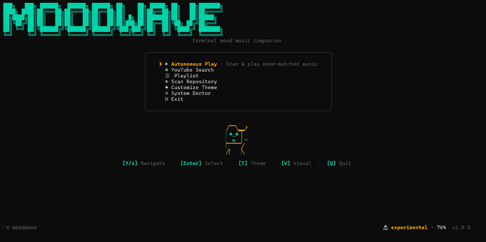
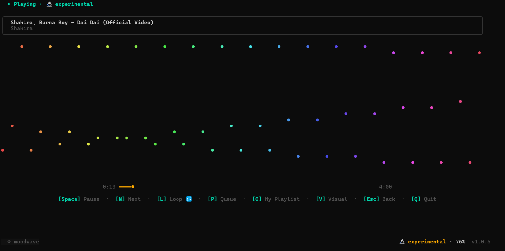
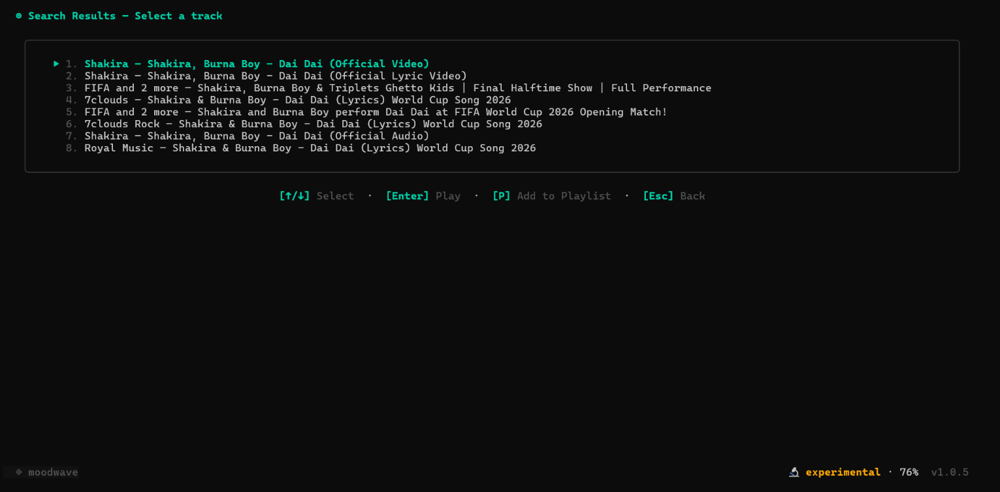

# Moodwave-CLI 🌊

> **A terminal-native developer mood music companion.**

<p align="left">
  
</p>

[](https://github.com/Boredooms/Moodwave-CLI/actions/workflows/ci.yml)
[](LICENSE)
[]()
[](https://go.dev)

Moodwave scans your codebase, extracts cognitive and workspace signals, infers your current coding mood profile, and streams perfectly matched audio directly inside your shell — with a full Bubble Tea TUI, 20+ live terminal visualizers, switchable themes, a curated personal playlist, and an in-app self-updater.

---

## 📸 Screenshots

### Home — mood, menu, and animated pixel companion

<p align="center">
  
</p>

### Now Playing — live visualizer, progress, and playback controls

<p align="center">
  
</p>

### Search — live YouTube results, pick a track or queue it

<p align="center">
  
</p>

---

## ⚡ Quick Install (Zero Dependencies)

No Go runtime, Python, or external languages required. Runs natively out of the box.

### macOS & Linux
```bash
curl -fsSL https://raw.githubusercontent.com/Boredooms/Moodwave-CLI/main/cli/scripts/install.sh | bash
```

### Windows (PowerShell)
```powershell
irm https://raw.githubusercontent.com/Boredooms/Moodwave-CLI/main/cli/scripts/install.ps1 | iex
```

*The installer automatically fetches the optimized binary matching your CPU (amd64, arm64, or arm) and OS, placing it in your system PATH.*

Then:

```bash
moodwave doctor   # verify terminal, audio backend, and source connectivity
moodwave init     # create config + cache directories
moodwave          # launch the interactive TUI
```

---

## ✨ What's New in v2.0.0

A ground-up rebuild of the terminal experience:

- **Full Bubble Tea TUI rewrite** — every screen (Home, Search, Now Playing, Live Queue, Personal Playlist, Doctor, Theme Select) is an independent, message-driven view.
- **Dedicated Personal Playlist** — a strictly FIFO curated list that always plays *before* the auto-generated queue, in its own window, with add/remove/clear controls that never disturb the currently playing track.
- **Redesigned playback state machine** — one `PlaybackQueue` type and a single `resolveOutcome()` decision point handling repeat-one/all/off, manual skip, and failure recovery.
- **20+ terminal visualizers** — Doom-style fire, matrix, plasma, aurora, lava, DNA, lightning, spiral, heartbeat, campfire, starfield, and more, all dynamically sized to your terminal.
- **7 switchable themes** — Midnight, Dracula, Nord, Tokyo Night, Gruvbox, Catppuccin, Solarized — applied live across every screen.
- **In-app self-updater** — checks GitHub on every launch and installs updates in place from the home screen (`[U]`), no separate command needed.
- **Auto-installing audio backend** — cross-platform `ffplay` auto-download plus a Doctor TUI with one-key auto-fix.

Full details in the [changelog](https://moodwave-cli.vercel.app/changelog).

---

## 🏗️ Technical Architecture

Moodwave is designed as a decoupled, multi-layered streaming client:

```
                  ┌─────────────────────────────────────┐
                  │          Codebase Workspace         │
                  └──────────────────┬──────────────────┘
                                     │ (Files, Git, TODOs)
                                     ▼
                  ┌─────────────────────────────────────┐
                  │ 01. Workspace Scanner               │
                  └──────────────────┬──────────────────┘
                                     │ (Language metrics, git tree depth)
                                     ▼
                  ┌─────────────────────────────────────┐
                  │ 02. Weighted Heuristics Mood Engine │
                  └──────────────────┬──────────────────┘
                                     │ (10 Developer Mood Profiles)
                                     ▼
                  ┌─────────────────────────────────────┐
                  │ 03. Tag-Based Recommender           │
                  └──────────────────┬──────────────────┘
                                     │ (BPM range, Tag overlap, History)
                                     ▼
         ┌───────────────────────────┼───────────────────────────┐
         ▼                           ▼                           ▼
┌──────────────────┐       ┌──────────────────┐        ┌──────────────────┐
│ YouTube (yt-dlp) │       │ Radio Browser API│        │   Jamendo API    │
└────────┬─────────┘       └────────┬─────────┘        └────────┬─────────┘
         │                          │                           │
         └──────────────────────────┼───────────────────────────┘
                                    ▼
                  ┌─────────────────────────────────────┐
                  │ 04. Playback Controller (mpv/ffplay)│
                  └──────────────────┬──────────────────┘
                                     │ (HTTP Range Resume & Stream)
                                     ▼
                  ┌─────────────────────────────────────┐
                  │ 05. Bubble Tea TUI + Visualizers    │
                  └──────────────────┬──────────────────┘
                                     │ (Fire, Matrix, Spectrum, Plasma...)
                                     ▼
                  ┌─────────────────────────────────────┐
                  │          Developer Terminal         │
                  └─────────────────────────────────────┘
```

1. **Workspace Scanner** — crawls the workspace to analyze language composition, TODO/FIXME density, git tree activity, and file count variance to build a codebase signature profile.
2. **Mood Inference Engine** — uses a weighted heuristics rule chain to map workspace signals to one of 10 developer moods (`focused`, `calm`, `intense`, `chaotic`, `sprint`, `debugging`, and more).
3. **Recommender** — selects and ranks candidate audio tracks matching the inferred mood parameters (BPM bounds, genre tags, energy levels, and playback history).
4. **Playback Controller** — dispatches streaming audio through system players (`mpv`, `ffplay`, `afplay`, or the native Windows backend) with automatic network re-establishment.
5. **Bubble Tea TUI** — renders every screen and visualizer through an async message-driven architecture, so audio never blocks the UI and the UI never blocks audio.

---

## 🛠️ CLI Command Reference

| Command | Description |
|---|---|
| `moodwave` | Launch the interactive TUI (scan, search, play, manage playlists) |
| `moodwave init` | Initialize configuration and directories |
| `moodwave scan` | Force-scan the repository and show inferred mood metrics |
| `moodwave mood` | Show the last detected mood profile without re-scanning |
| `moodwave play` | Play streams matching your current coding mood |
| `moodwave search <query>` | Query YouTube manually and play the selected stream |
| `moodwave queue` | Show the current recommendation queue |
| `moodwave next` | Skip the current track and fetch the next recommendation |
| `moodwave status` | Print current CLI and playback progress information |
| `moodwave config` | View or edit the resolved configuration |
| `moodwave theme` | Toggle active TUI display themes |
| `moodwave visual` | Switch visualizer modes |
| `moodwave source` | List music sources and their live health status |
| `moodwave update` | Download and replace the binary with the latest release |
| `moodwave doctor` | Inspect and verify local system capabilities and audio components |

### TUI keyboard shortcuts

| Key | Context | Action |
|---|---|---|
| `↑` / `↓` | Anywhere | Navigate |
| `Enter` | Anywhere | Select |
| `Space` | Now Playing | Pause / resume |
| `N` | Now Playing | Next track |
| `L` | Now Playing | Cycle repeat: off → one → all |
| `P` | Now Playing | Open Live Queue |
| `O` | Now Playing / Queue | Open Personal Playlist |
| `A` | Playlist views | Search and add a track |
| `D` | Playlist views | Remove the selected track |
| `C` | Personal Playlist | Clear the whole personal playlist |
| `T` | Anywhere | Theme selector |
| `V` | Anywhere | Cycle visualizer |
| `U` | Home | Install available update |
| `Q` / `Esc` | Anywhere | Back / quit |

---

## 💻 Local Compilation & Development

Ensure you have **Go 1.24+** installed on your development machine.

1. Clone the repository:
   ```bash
   git clone https://github.com/Boredooms/Moodwave-CLI.git
   cd Moodwave-CLI/cli
   ```
2. Run unit tests (`-short` skips tests that hit live third-party APIs):
   ```bash
   go test ./... -short
   ```
3. Vet and compile the local binary:
   ```bash
   go vet ./...
   go build -o moodwave ./cmd/moodwave
   ```
4. Verify the executable:
   ```bash
   ./moodwave doctor
   ```

The website lives in `website/` (Next.js):

```bash
cd website
npm ci
npm run dev
```

---

## 📚 Documentation

- [Installation Guide](docs/install.md)
- [Command Reference](docs/commands.md)
- [Architecture](docs/architecture.md)
- [Technical Design](docs/technical.md)
- [CLI Design](docs/cli.md)
- [CLI Design System](docs/cli_design.md)
- [Music Sources](docs/sources.md)
- [Project Status](docs/STATUS.md)
- [Idea & Vision](docs/idea.md)

Web docs, including per-platform setup for Windows / macOS / Linux, are at [/docs on the website](https://moodwave-cli.vercel.app/docs).

---

## 📄 License

Distributed under the MIT License. See `LICENSE` for details.

---

*The terminal is the UI. The music is the atmosphere. The mood is the signal.*
